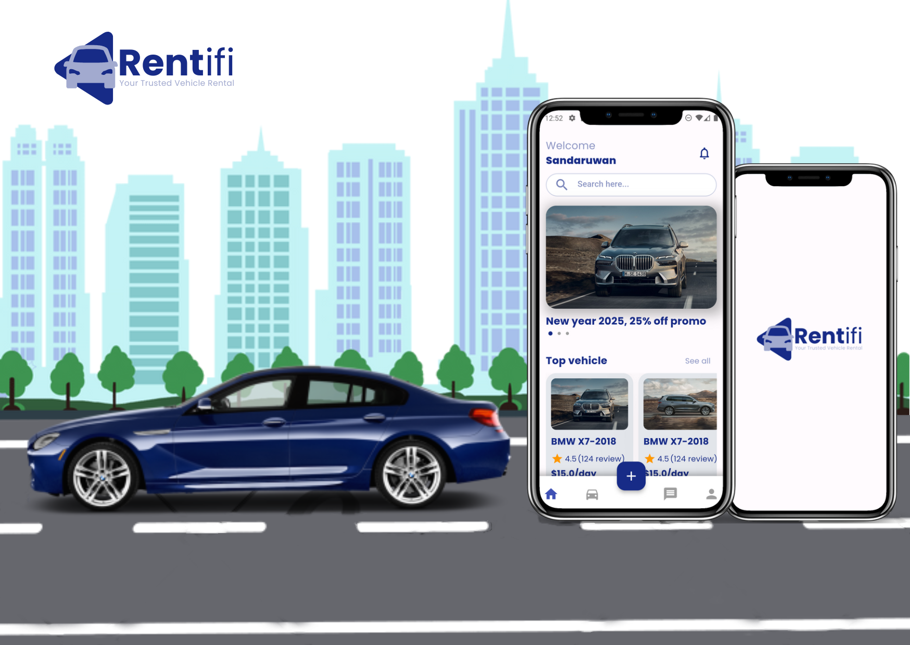
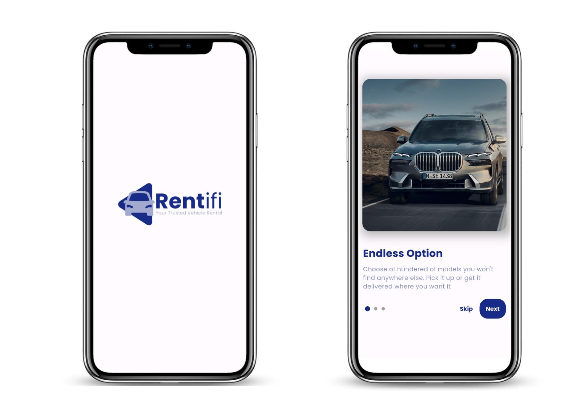
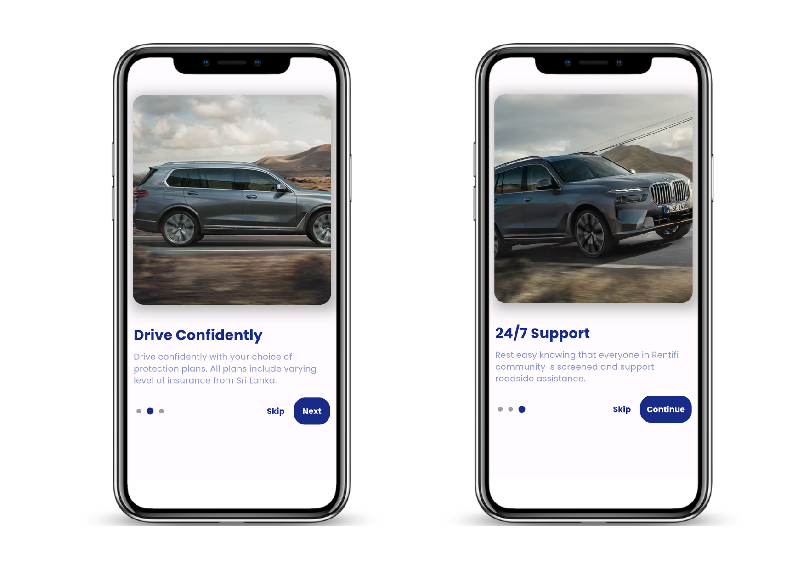
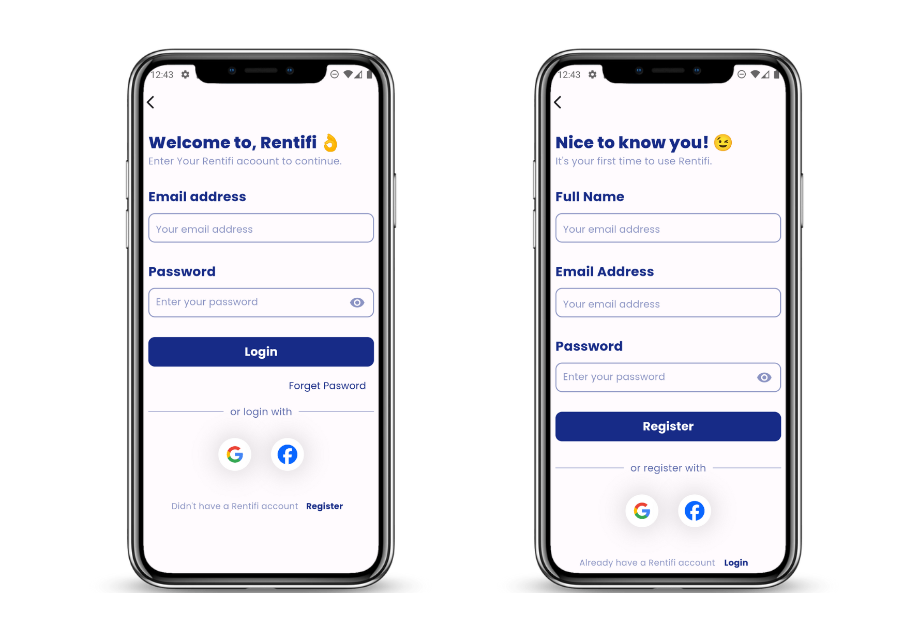
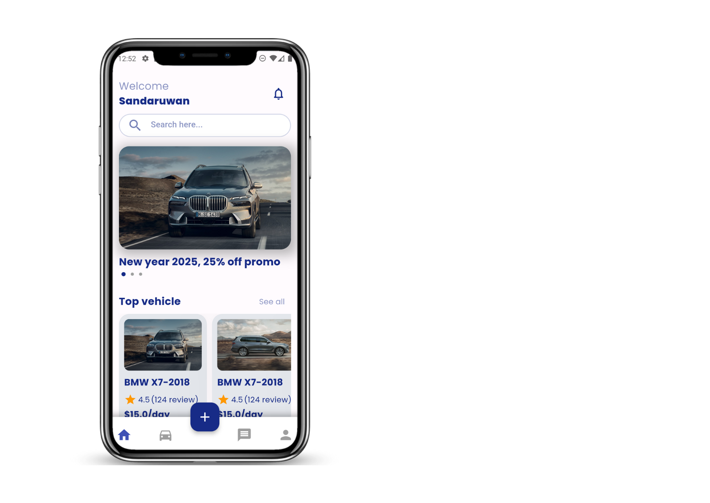

# Rentifi - Car Renting Application

## About the Project

Rentifi is a Flutter-based mobile application that allows users to list their vehicles for rent. It offers a seamless experience for both vehicle owners and potential buyers. The app integrates Google Maps to pin vehicle locations, allowing users to find cars near them. It also enables users to chat with vehicle owners, filter cars based on preferences, and leave reviews for the listed vehicles.

The app provides an efficient way for users to rent or buy cars, pay for rentals through the app, and collect their rented cars at the pinned location. It’s a one-stop solution for vehicle rental and purchasing.

## Key Features

- **Vehicle Listing**: Users can list their vehicles for rent or sale.
- **Location Integration**: Google Maps API is used to pin the location of the listed vehicle.
- **Chat with Owners**: Buyers can communicate with vehicle owners before finalizing the deal.
- **Payment Integration**: Buyers can securely pay the rent amount through the app.
- **Location-based Search**: Buyers can filter vehicles by proximity to their location.
- **Preferences Filter**: Buyers can filter cars based on model and other preferences.
- **Reviews**: Buyers can leave reviews for listed vehicles after using them.

## Technologies Used

- **Flutter**: Used to develop the mobile application for Android.
- **Google Maps API**: Integrated for displaying and pinning vehicle locations.
- **Firebase**: Used for user authentication and real-time database.

  
  

  
  

